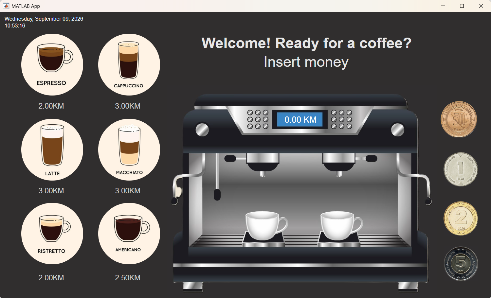

# MATLAB Coffee Machine Simulator

A graphical coffee machine simulator developed using **MATLAB App Designer** as a **group project for the Introduction to Engineering course in Fall 2023**.

The application simulates the process of purchasing coffee, inserting coins, tracking the machine's available money, and automatically calculating the appropriate change.

The project combines graphical user interface development, event-driven programming, file handling, audio feedback, and state management to create an interactive simulation of a real-world coffee machine.

---

## Table of Contents

* [Overview](#overview)
* [Features](#features)
* [Available Drinks](#available-drinks)
* [Payment System](#payment-system)
* [Change Calculation](#change-calculation)
* [Graphical User Interface](#graphical-user-interface)
* [Machine Data and State](#machine-data-and-state)
* [Audio Feedback](#audio-feedback)
* [Technologies Used](#technologies-used)
* [How to Run](#how-to-run)
* [Project Structure](#project-structure)
* [Project Goals](#project-goals)
* [Limitations](#limitations)
* [Possible Improvements](#possible-improvements)
* [Academic Context](#academic-context)
* [Team](#team)
* [License](#license)

---

## Overview

This project represents a virtual coffee machine with an interactive graphical user interface developed in **MATLAB App Designer**.

Users can select a beverage, insert coins, monitor their inserted amount, and complete or cancel a transaction. The simulator maintains the machine's internal state, including the money and coins available inside the machine.

A key part of the project is the **change-management system**, which considers the denominations currently available in the machine when calculating the customer's change.

The project was designed to demonstrate how programming concepts can be applied to simulate a familiar real-world system.

---

## Features

The coffee machine simulator includes:

* Interactive graphical user interface
* Multiple coffee selections
* Display of beverage prices
* Coin-based payment system
* Tracking of inserted money
* Machine balance management
* Automatic change calculation
* Coin availability management
* Transaction cancellation
* Error and status messages
* Coffee preparation animations
* Audio feedback
* Date and time display
* Persistent machine data
* Visual coffee images and interface elements

---

## Available Drinks

The simulator provides the following beverages:

| Drink      |   Price |
| ---------- | ------: |
| Espresso   | 2.00 KM |
| Cappuccino | 3.00 KM |
| Latte      | 3.00 KM |
| Macchiato  | 3.00 KM |
| Ristretto  | 2.00 KM |
| Americano  | 2.50 KM |

The user selects a beverage through the graphical interface before completing the payment.

---

## Payment System

The coffee machine accepts the following coin denominations:

* **0.50 KM**
* **1 KM**
* **2 KM**
* **5 KM**

When a coin is inserted, the amount is added to the user's current payment and displayed on the interface.

The machine continuously tracks the amount inserted and determines whether the user has provided sufficient funds for the selected beverage.

Once sufficient funds have been inserted, the user can proceed with the purchase.

The system also keeps track of the coins currently available inside the machine.

---

## Change Calculation

One of the main features of the simulator is its change-making system.

Instead of simply calculating:

```text
change = inserted_money - drink_price
```

the program also considers the denominations available inside the machine.

The system attempts to provide the required change using the coins currently available while updating the machine's internal coin balance.

This makes the simulation more representative of an actual coin-operated machine.

### Example

If a customer purchases a drink costing:

```text
2.00 KM
```

and inserts:

```text
5.00 KM
```

the required change is:

```text
5.00 KM - 2.00 KM = 3.00 KM
```

The simulator then determines whether the available coins can be used to provide the required amount.

If the machine cannot provide the necessary change with its available coins, the transaction can be handled accordingly.

---

## Graphical User Interface

The application was developed using **MATLAB App Designer** and provides an interactive interface designed to resemble a real coffee machine.

The interface includes:

* Coffee selection buttons
* Coffee images
* Beverage prices
* Coin input buttons
* Inserted-money display
* Machine status messages
* Transaction controls
* Coffee preparation animations
* Audio feedback
* Date and time display

The GUI uses event-driven programming, where different user actions trigger corresponding MATLAB functions.

---

## Machine Data and State

The coffee machine maintains information about its current state during operation.

The project uses data files to store information such as:

* Money currently available inside the machine
* Available coin denominations and quantities
* Machine state
* Transaction-related information

This allows the simulator to work with a predefined initial machine balance and maintain relevant information while the application is being used.

The machine's internal coin balance is updated as coins are inserted and as change is returned.

---

## Audio Feedback

Audio effects are used to make the simulation more interactive.

Different sounds can be triggered by events such as:

* Inserting a coin
* Starting coffee preparation
* Completing a coffee
* Cancelling a transaction
* Insufficient funds
* Returning change

This provides additional feedback to the user and contributes to the overall simulation experience.

---

## Technologies Used

The project was developed using:

* **MATLAB**
* **MATLAB App Designer**
* MATLAB UI components
* MATLAB event-handling functions
* MATLAB audio functions
* MATLAB file and data handling
* Image assets
* Animation components

---

## How to Run

### Requirements

To run the project, you need:

* MATLAB
* MATLAB App Designer
* All required project assets, including images, audio files, and data files

### Running the Application

1. Clone or download this repository.
2. Open MATLAB.
3. Make sure all project files and supporting assets are located in the appropriate directories.
4. Open the `.mlapp` file using MATLAB App Designer.
5. Run the application.
6. Select a beverage and use the coin buttons to simulate a purchase.

> Make sure that the required image, audio, and data files remain in their expected locations. Moving or renaming these files may prevent certain parts of the application from working correctly.

---

## Project Structure

A recommended repository structure is:

```text
matlab-coffee-machine/
│
├── CoffeeMachine.mlapp
│
├── images/
│   ├── coffee-machine-preview.png
│   └── ...
│
├── audio/
│   ├── coin.wav
│   ├── coffee-ready.wav
│   └── ...
│
├── data/
│   └── machine-data.mat
│
├── docs/
│   └── Project_Report.pdf
│
└── README.md
```

The exact file names and folder structure should match the files included in the project.

---

## Preview



The interface provides a visual representation of the coffee machine and allows users to interact with the simulator through buttons and other App Designer components.

---

## Project Goals

The main goals of the project were to:

* Develop an interactive GUI using MATLAB App Designer.
* Simulate a real-world coffee machine.
* Apply programming concepts to a practical system.
* Implement event-driven user interaction.
* Implement a payment and coin-management system.
* Calculate and return change based on available coins.
* Manage the internal state of the machine.
* Work with persistent data.
* Integrate images, animations, and audio feedback.
* Create an intuitive and engaging user experience.

---

## Limitations

The current implementation has several limitations:

* The simulator supports a predefined selection of beverages.
* The available coin denominations are fixed.
* The number and type of coins are managed according to the implemented machine state.
* The application depends on MATLAB and App Designer.
* Supporting images, audio files, and data files must be available for all features to work correctly.
* The graphical interface is designed specifically for the project and is not intended as a production-ready coffee machine controller.

---

## Possible Improvements

Future versions could extend the project with:

* Additional beverages
* Customizable beverage prices
* More payment methods
* Improved change-making algorithms
* More sophisticated inventory management
* Coffee ingredient tracking
* Low-stock notifications
* Administrative or maintenance mode
* User purchase history
* Improved GUI responsiveness
* More realistic coffee preparation animations
* Enhanced error handling
* Database integration
* Improved accessibility

---

## Learning Objectives

Through this project, the team gained practical experience with:

* MATLAB programming
* MATLAB App Designer
* Graphical user interface development
* Event-driven programming
* Callback functions
* User input handling
* File and data management
* State management
* Algorithm design
* Coin and change calculations
* Audio integration
* Image and animation handling
* Simulation of real-world systems

---

## Academic Context

This project was developed as a **group project for the Introduction to Engineering course during Fall 2023**.

The project provided an opportunity to apply programming and engineering concepts to the design and implementation of a simulated real-world system.

The coffee machine was selected as a practical example through which the team could explore user interaction, system state, input processing, data management, and algorithmic problem solving.

**Course:** Introduction to Engineering
**Semester:** Fall 2023
**Project Type:** Group Project
**Development Environment:** MATLAB App Designer

---

## Team

This project was completed collaboratively as part of the **Introduction to Engineering** course.

The design, implementation, testing, and documentation were carried out as a group.

---

## License

This project was developed for **educational and academic purposes** as part of a university course project.

